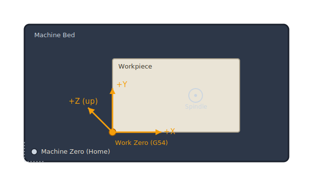
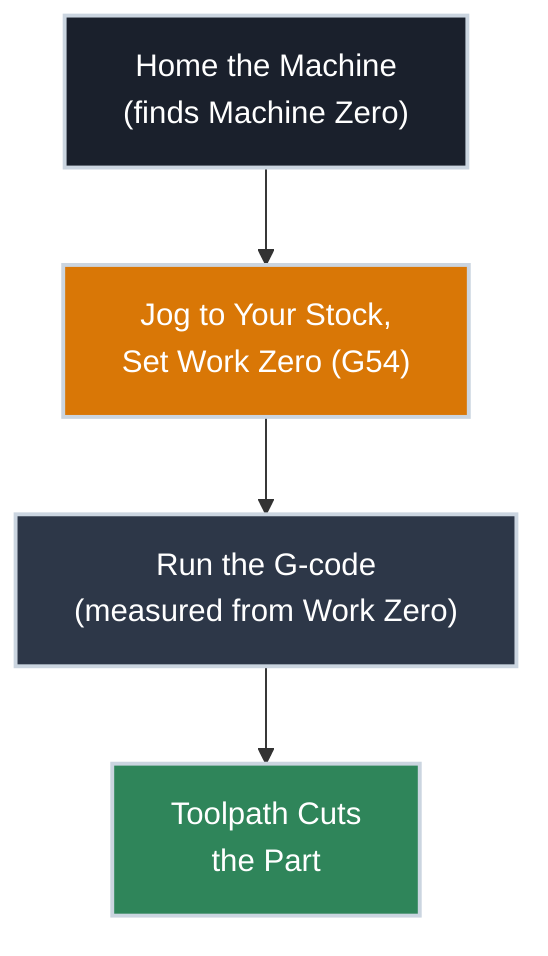

# Axes and Coordinate Systems

!!! abstract "Beginner"
    No prior CAD, CAM, or machining knowledge required.

The first time you jog a CNC router with the arrow keys, you're watching three numbers change on a screen: X, Y, Z. Every single thing the machine does after that — every cut, every hole, every finished pass — comes down to nothing more than those three numbers changing in a planned sequence.

That sounds simple, and it is. What trips people up isn't the numbers themselves — it's that the machine actually keeps track of **two different starting points** for them, and mixing the two up is the single most common reason a first cut goes wrong.

By the end of this article you'll know what those three axes physically mean, why the machine needs two separate zeros, and why "it cut in the wrong spot" almost always traces back to one of them.

---

## The Three Axes

A CNC router moves in three independent, straight-line directions:

- **X** — side to side
- **Y** — front to back
- **Z** — up and down (the spindle or router plunges into the material along this axis)

???+ info "Definition: Axis"
    An **axis** is a single line of independent travel the machine can move along, measured in millimeters (or inches) from a reference point. A 3-axis router — the kind most hobbyists start with — has exactly three: X, Y, and Z. Every position the machine can reach is just a combination of a value on each.

Combine all three and you get a **coordinate** — a single point in space, written as `X10 Y25 Z-3`. That's the entire vocabulary. There's no other way to tell a CNC router where to go.

<figure markdown>
  { width="480" }
  <figcaption>Machine zero is fixed to the machine frame and found by homing. Work zero (set with G54) is wherever you put it on your stock — and that's what your G-code coordinates are actually measured from.</figcaption>
</figure>

---

## Machine Zero: Found by Homing

Stepper motors have no built-in sense of position — power them off and they forget where they were entirely. So every time you power up the machine, it needs to re-establish a reference point before it can trust any coordinate.

That's what **homing** does. The machine drives each axis toward a fixed limit switch — usually one corner of the frame — until it triggers, then treats that exact point as **Machine Zero**. Sometimes called the Machine Coordinate System (MCS), this zero is fixed to the physical frame and never moves.

!!! warning "Always Home Before You Do Anything Else"
    Skipping the homing cycle means the machine has no idea where it actually is — it's just trusting whatever position it happened to power on at. Jogging or running a job before homing risks driving an axis past its physical limit, which can strip a belt, skip steps, or crash the spindle into the frame. Home first, every session, no exceptions.

---

## Work Zero: Where Your Part Actually Begins

Machine zero is fixed to the frame — which makes it almost useless for day-to-day work, since your stock isn't bolted to a fixed spot on the frame. It moves every time you clamp down a new piece of wood or aluminum.

That's the problem **Work Zero** solves. You jog the machine to a specific point on your actual workpiece — a corner, usually the top surface — and tell the controller "this is X0 Y0 Z0." In GRBL and most hobbyist controllers, that's stored as a work coordinate system offset, most commonly `G54`.

???+ info "Definition: Work Coordinate System"
    A **work coordinate system** (WCS) is an offset from machine zero that you define yourself, tied to your workpiece rather than the machine frame. `G54` is the first and most commonly used of several available slots (`G54`–`G59`), which lets you store multiple work zeros — handy if you have several fixtures set up at once.

    Every coordinate in a G-code file is measured **from work zero**, not machine zero. That's the whole point: the same G-code file cuts correctly no matter where on the table your stock happens to be clamped, because the file only knows about `G54`, and you're the one who tells the machine where `G54` is today.

Notice machine zero only shows up once, at the very start. After homing, everything else — jogging, setting work zero, running the job — happens relative to whatever `G54` you set.

---

## Why Getting This Wrong Ruins a Cut

The most common beginner mistake isn't a math error — it's forgetting that work zero doesn't persist automatically the way you'd expect. Bump the stock, re-clamp it in a slightly different spot, or start a new session without resetting `G54`, and the machine will confidently run the exact same G-code — just measured from the wrong starting point.

!!! danger "A Bad Zero Can Break a Bit at Full Speed"
    If work zero is wrong, the first move of a job might plunge the bit into your clamp, drive it into the spoilboard at full rapid speed, or miss the stock entirely and cut into thin air before slamming into a clamp on the far side. A bit shattering at 10,000+ RPM sends hard fragments flying. Before running any job, jog to `X0 Y0` and confirm — by eye — that the bit is actually sitting where you expect it to be on the stock.

This is also why every article on this site that includes a G-code example will explicitly tell you what it assumes about work zero — usually the top-left corner of the stock at the material's top surface. If you're following along on your own machine, that assumption has to match reality before you hit start.

---

## Practice

??? question "1. Machine Zero vs. Work Zero"

    What's the difference between machine zero and work zero, and why can't a G-code file just always be written relative to machine zero?

    ??? tip "Solution"
        Machine zero is fixed to the machine's frame and found by homing — it never moves. Work zero is wherever *you* set it on your actual workpiece, usually via `G54`.

        A G-code file can't safely use machine zero because your stock isn't in a fixed position relative to the frame — it moves every time you clamp a new piece of material. Writing the file relative to work zero means the same file cuts correctly regardless of exactly where on the table the stock is clamped, as long as you set `G54` correctly each time.

??? question "2. Re-clamping Mid-Job"

    You home the machine, set work zero on your stock, and start cutting. Halfway through, you pause because the workpiece has shifted slightly and needs to be re-clamped. What do you need to redo before resuming, and why?

    ??? tip "Solution"
        You need to re-set work zero (`G54`) on the workpiece in its new position — the stock moved relative to the machine frame, so the old work zero no longer points at the same physical spot on the material. Simply resuming the job with the old `G54` value would cut everything offset by however far the stock shifted. Homing does *not* need to be redone (machine zero hasn't changed), only the work offset.

??? question "3. Why Home Every Time?"

    The machine was used yesterday in exactly the same way. Why does it still need to be re-homed today, instead of just remembering where it was?

    ??? tip "Solution"
        Stepper motors (and the GRBL-style controllers that drive them) have no memory of position once power is cut — they only know their position by counting steps from a known reference point. The moment the machine powers off, that reference is lost. Homing re-establishes it by physically driving each axis to a limit switch, which is the only way the controller can be certain of where it actually is.

??? question "4. G53 vs. G54"

    A friend mentions that GRBL also supports `G53`, which moves in machine coordinates instead of work coordinates. When would you actually want to use that instead of `G54`?

    ??? tip "Solution"
        `G53` is useful for moves that need to reference the machine frame itself rather than your workpiece — for example, sending the spindle to a fixed tool-change or parking position that's always in the same physical spot on the machine, regardless of where the current work zero happens to be set. It's rarely used in everyday cutting, where nearly every move should be relative to your stock via `G54`.

---

## Quick Recap

-   **Axes (X/Y/Z)**

    ---

    Three independent lines of travel. Every position the machine can reach is a combination of a value on each.

-   **Machine Zero**

    ---

    Fixed to the machine frame. Found by **homing**, which must happen every time the machine powers on.

-   **Work Zero (G54)**

    ---

    Set by you, on your actual workpiece. This is what every coordinate in a G-code file is measured from.

-   **The Failure Mode**

    ---

    Re-clamping stock without resetting work zero runs the same file against the wrong starting point — the single most common cause of a ruined first cut.

---

## What's Next

The next article, **[Reading G-code](reading_gcode_basics.md)**, shows how these two coordinate systems actually appear inside a real G-code file — and why a generated file can look like a wall of numbers even though the vocabulary behind it is small.

---

## Further Reading

**Official Documentation**

- [GRBL Wiki](https://github.com/gnea/grbl/wiki) — homing cycles, work coordinate systems, and the specific G-code subset GRBL-based controllers understand
- [LinuxCNC G-code Overview](https://linuxcnc.org/docs/html/gcode/overview.html) — a deeper, controller-agnostic explanation of coordinate systems and modal state

**Related Articles**

- [Reading G-code](reading_gcode_basics.md) — how `G54` and axis coordinates actually show up line by line in a generated file

**Reference Hardware**

- [Inventables X-Carve](https://www.inventables.com/technologies/x-carve) — the reference machine used for examples on this site
