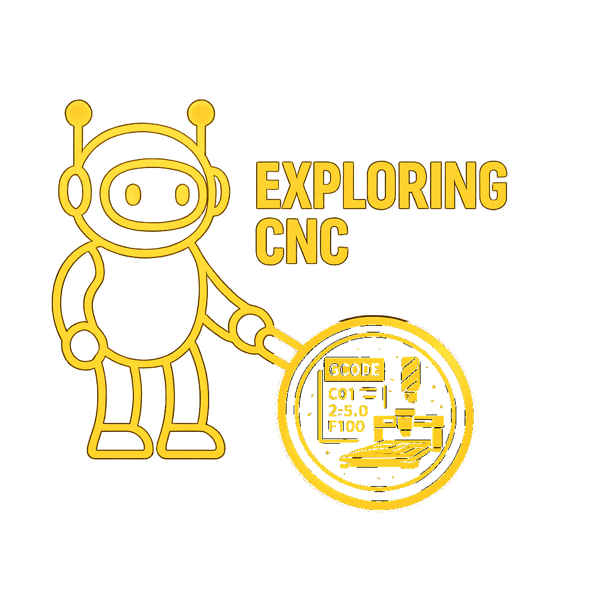

# Exploring CNC

A CNC router turns a digital model into a physical part. The question is whether you understand what's happening between the model and the cut, or you're just clicking "generate toolpath" and hoping.

This site documents an open-source CNC workflow from first principles: designing in FreeCAD, generating toolpaths, understanding the G-code that comes out the other end, and driving the machine with Universal Gcode Sender — not just how to follow a setup guide, but why the workflow is built the way it is.

## Who This Is For

Anyone starting out with a hobbyist CNC router — a new build, a used machine, or a kit — who wants to actually understand the process instead of copying setup videos. No prior machining or CAD experience assumed.

## Where Do You Start?

Articles are grouped into **topics** — the subjects of CNC work, like coordinate systems and toolpaths. Each article carries a difficulty tag (Beginner, Intermediate, Advanced) so you can gauge depth at a glance, but there's no paywall or tier to unlock — just start wherever your machine and your questions are.

-   :material-flag-checkered: **New to CNC?**

    ---

    Start at the very beginning — no prior knowledge assumed.

    [:octicons-arrow-right-24: Start with Axes and Coordinate Systems](axes_and_coordinate_systems.md)

-   :material-file-code: **Staring at a generated file?**

    ---

    Learn the small vocabulary behind every G-code file.

    [:octicons-arrow-right-24: Start with Reading G-code](reading_gcode_basics.md)

---

## Topics

**Machine Foundations**

- [Axes and Coordinate Systems](axes_and_coordinate_systems.md) — What X, Y, and Z actually mean, and why the machine needs two separate zeros

**Reading G-code**

- [Reading G-code](reading_gcode_basics.md) — The small vocabulary behind every generated file, and why "modal" state matters

**CAD/CAM Workflow, Machine Control, Materials & Cutting, Maintenance & Calibration** *(coming soon)*

## Part of the BradPenney.io Network

This site is part of a family of progressive technical learning resources:

- [Exploring Electronics](https://electronics.bradpenney.io) — Electronics and physical computing from first principles
- [Exploring Linux](https://linux.bradpenney.io) — Linux for developers and platform engineers
- [Exploring Python](https://python.bradpenney.io) — Python automation for platform engineers
- [Exploring Computer Science](https://cs.bradpenney.io) — CS theory for working engineers
