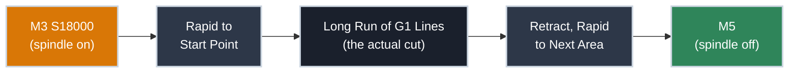

# Reading G-code

!!! abstract "Beginner"
    No prior CAD, CAM, or machining knowledge required.

Open a `.gcode` or `.nc` file straight out of a CAM program and it looks like noise — thousands of lines of letters and numbers, no comments, no narrative. It's tempting to conclude you'd need to be some kind of programmer to make sense of it.

You don't. G-code is plain text with a genuinely small vocabulary — a lot smaller than it looks. What makes a real file feel unreadable isn't complexity, it's volume: a single curved cut gets flattened into hundreds of nearly-identical lines. Once you can see past that, a 2,000-line file stops looking like static and starts looking like a flat list of "go here, then here, then here."

By the end of this article, you'll be able to open a generated file and immediately tell what it's doing — without reading every line.

---

## A Line Is Just a Set of Words

Every line of G-code is built from **words** — a letter followed by a number. Here's a handful of real lines, annotated:

```gcode title="A Few Lines from a Real Toolpath" linenums="1"
G90               ; (1)!
G54               ; (2)!
G0 X0 Y0          ; (3)!
G1 Z-5 F300       ; (4)!
G1 X50 F800       ; (5)!
M5                ; (6)!
```

1. `G90` — absolute positioning: every coordinate is measured from work zero, not from wherever the machine last was.
2. `G54` — use the work coordinate system you set (see [Axes and Coordinate Systems](axes_and_coordinate_systems.md)).
3. `G0` — a rapid move: the fastest the machine can safely travel, with no cutting happening. This one returns to work zero in X and Y.
4. `G1` — a controlled, feed-rate-limited move — this is an actual cut, not a rapid. Plunges straight down to `Z-5` at 300 mm/min.
5. Still `G1` — the only thing that changed is a new feed rate, `F800`. The move itself cuts a straight line out to `X50`.
6. `M5` — stop the spindle.

???+ info "Definition: Modal Command"
    A **modal** command stays in effect on every line after it, until it's explicitly changed. `F300` on line 4 doesn't just apply to that one line — it stays active until something sets a new feed rate, which is exactly what happens on line 5.

    This is the single biggest gotcha when reading a file cold: if a line doesn't show an `F`, that doesn't mean "no feed rate." It means "whatever feed rate was set most recently." The same is true for `G0`/`G1` (motion mode) and the active work coordinate system — they all persist until changed.

---

## The Small Vocabulary Behind Almost Everything

<div class="grid cards two-col" markdown>

-   :material-cursor-move: **`G0` / `G1` — Movement**

    ---

    **Why it matters:** every cut is just movement. `G0` rapids between cuts with no cutting; `G1` feeds in a straight line while cutting.

    **Tell:** a `G1` paired with a small `Z` move is almost always a plunge into the material.

-   :material-vector-curve: **`G2` / `G3` — Arcs**

    ---

    **Why it matters:** curves aren't always flattened into tiny straight segments — `G2` (clockwise) and `G3` (counterclockwise) can cut a true arc in one line.

    **Tell:** look for an `I`/`J` pair alongside the endpoint — that's the arc's center, relative to the start point.

-   :material-crosshairs-gps: **`G54`–`G59` — Work Offsets**

    ---

    **Why it matters:** these select *which* work zero is active. Covered in full in [Axes and Coordinate Systems](axes_and_coordinate_systems.md).

    **Tell:** usually appears once, near the top of a file, right after `G90`.

-   :material-power: **`M3` / `M5` — Spindle On/Off**

    ---

    **Why it matters:** these bracket the entire cutting operation. `M3 S18000` starts the spindle at 18,000 RPM; `M5` stops it.

    **Tell:** `M3` near the top, `M5` at the very bottom — the "skeleton" of a job.

</div>

---

## Why a Generated File Looks Like a Wall of Numbers

A CAM program doesn't write G-code the way a person would. Ask it to cut a rounded pocket, and it flattens that curve into hundreds of straight-line segments — each one a separate `G1` line, each moving the tool by a fraction of a millimeter.

```gcode title="Excerpt from a Generated Pocket Toolpath (abbreviated)" linenums="45"
G1 X12.400 Y8.221
G1 X12.412 Y8.204
G1 X12.431 Y8.183
G1 X12.455 Y8.158
```

Notice what's *missing*: no `F` on any of these lines. That's modal state again — the feed rate was set once, several lines earlier, and every line here just inherits it. The coordinates barely change line to line because that's exactly how a smooth curve gets approximated: many small straight steps standing in for one continuous arc.

This is the "volume, not complexity" problem. Individually, every one of these lines is trivial. There are just a lot of them.

---

## Reading Without Getting Lost

You don't read a generated file top to bottom like prose. Instead:

1. **Scan for `M` codes first.** They're rare and structural — `M3`/`M5` (spindle on/off), and `M2`/`M30` (end of program) mark the skeleton of the whole job.
2. **Treat a run of `G1` lines as one continuous cut**, not as individual moves to inspect one by one. If the coordinates are changing by fractions of a millimeter, it's a curve being approximated — not something to trace line by line.
3. **Watch for a new `F` or `S` value** — that's the moment feed rate or spindle speed actually changes, which is worth noticing; everything between changes is just "more of the same."



That's the shape of nearly every job: spindle on, rapid into position, a long block of feed-rate-limited cutting, then spindle off. Once you can spot that shape, the thousands of lines in between stop being intimidating — they're just the details of the cut you already understand.

---

## Safety: Read Before You Run

!!! warning "Preview Before You Cut"
    Always preview a new G-code file in your sender's visualizer (Universal Gcode Sender includes one) before running it on the machine. A mis-set work zero, or a rapid move that happens to pass through material because `Z` wasn't lifted first, can snap a bit or gouge the spoilboard — and it happens in the first few seconds, at full rapid speed.

!!! danger "Stay Near the Feed Hold on a First Run"
    The first time you run a file you didn't write yourself, keep a hand near the feed-hold or stop control and watch the first several moves closely. If the machine heads somewhere you don't expect, stop it immediately — diagnosing a wrong `G54` offset is much cheaper than a broken bit or a ruined workpiece.

---

## Practice

??? question "1. Missing Feed Rate"

    A line reads `G1 X20 Y10` — no `F` anywhere on the line. What feed rate does the machine actually use, and why?

    ??? tip "Solution"
        Whatever feed rate was most recently set by an earlier `F` word. Feed rate is modal — it persists across lines until a new `F` value appears, so a line without one isn't running "no feed rate," it's running the last one that was specified.

??? question "2. Why So Many Lines?"

    Two toolpaths take the same amount of time to run: one is a single straight cut, the other is a curved pocket. Why does the curved one produce vastly more lines of G-code?

    ??? tip "Solution"
        A straight cut is genuinely one motion — one `G1` line covers it. A curve (unless the CAM post-processor emits true `G2`/`G3` arcs) has to be approximated as a series of very short straight-line segments, each one its own `G1` line. The runtime can be identical; the line count reflects how the *shape* was approximated, not how long the cut takes.

??? question "3. Reading the Skeleton"

    A file has `M3 S18000` near the top and `M5` at the very bottom, with a large block of `G1` lines in between. Without reading every line, what do you already know about this file?

    ??? tip "Solution"
        The spindle spins up to 18,000 RPM before any cutting starts, runs continuously through one large cutting operation, and stops only once, at the very end. There's no tool change and no pause in spindle rotation partway through — it's a single, continuous job from start to finish.

??? question "4. G0 vs. G1 for the Same Job"

    Explain why a job typically uses `G0` to rapid to `X0 Y0` at the very start, but never uses `G0` to plunge into the material for an actual cut.

    ??? tip "Solution"
        `G0` is a rapid move — the fastest the machine can safely travel, with no regard for cutting forces, because it assumes the tool isn't engaged with material. That's fine above the stock, moving to a starting position. But plunging into material at rapid speed ignores chip load and feed rate entirely — it can snap the bit or stall the spindle instantly. Any move that actually removes material has to be a feed-rate-controlled `G1` (or `G2`/`G3`), never a `G0`.

---

## Quick Recap

<div class="grid cards two-col" markdown>

-   **G words**

    ---

    Motion and setup: `G0` rapid, `G1` feed, `G2`/`G3` arcs, `G54` work offset.

-   **M words**

    ---

    Machine on/off state: `M3`/`M5` spindle, `M2`/`M30` end of program.

-   **Modal state**

    ---

    A value (feed rate, motion mode, work offset) stays active until a line explicitly changes it — silence doesn't mean "off" or "zero."

-   **Read the skeleton first**

    ---

    Scan `M` codes for structure, then treat long runs of `G1` as one continuous cut rather than individual lines.

</div>

---

## What's Next

This site's next topic covers the CAD/CAM workflow in FreeCAD that actually generates files like the ones in this article — modeling a part, then letting the Path workbench turn it into exactly the G-code you now know how to read.

---

## Further Reading

**Official Documentation**

- [LinuxCNC G-code Command Reference](https://linuxcnc.org/docs/html/gcode/g-code.html) — the full reference for every G and M code, including many not covered here
- [GRBL Wiki: Supported G-codes](https://github.com/gnea/grbl/wiki) — the specific subset of G-code a GRBL-based controller actually understands

**Related Articles**

- [Axes and Coordinate Systems](axes_and_coordinate_systems.md) — what `G54` and the X/Y/Z coordinates in this article are actually measured from

**Practical Tools**

- [Universal Gcode Sender](https://github.com/winder/Universal-G-Code-Sender) — the sender used throughout this site to preview and run G-code on the reference machine
